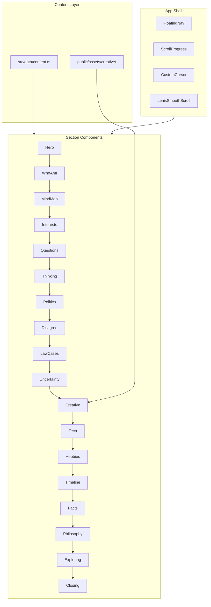

# Akash Sankar — Personal Identity Portfolio

## Current State

- **Workspace:** [`C:\Users\akash\Desktop\portfolio`](C:\Users\akash\Desktop\portfolio) is empty (greenfield).
- **Git note:** A repo exists at `C:\Users\akash\.git` (home level). Initialize a **dedicated** repo inside the portfolio folder during implementation — do not commit from the home-level git.

## Architecture



**Stack (as specified):**
- Vite + React 19 + TypeScript
- Tailwind CSS v4 (`@tailwindcss/vite`)
- Framer Motion (section transitions, scroll reveals)
- GSAP + ScrollTrigger (text choreography, question carousel)
- Lenis (`lenis` package — successor to `@studio-freight/lenis`)
- React Three Fiber + drei (hero background + "The Mind" 3D object)

## Project Structure

```
portfolio/
├── public/
│   └── assets/
│       └── creative/          # User-provided gallery images go here
├── src/
│   ├── components/
│   │   ├── layout/
│   │   │   ├── Nav.tsx
│   │   │   ├── Footer.tsx
│   │   │   ├── CustomCursor.tsx
│   │   │   ├── ScrollProgress.tsx
│   │   │   └── SectionWrapper.tsx
│   │   ├── sections/          # One file per major section (20 files)
│   │   ├── ui/                # MagneticButton, RevealText, CaseCard, etc.
│   │   └── three/
│   │       ├── HeroScene.tsx
│   │       └── MindObject.tsx
│   ├── data/
│   │   └── content.ts         # All copy, cases, questions, hobbies — single source
│   ├── hooks/
│   │   ├── useLenis.ts
│   │   ├── useReducedMotion.ts
│   │   ├── useMediaQuery.ts
│   │   └── useScrollProgress.ts
│   ├── styles/
│   │   └── globals.css        # Grain overlay, typography, CSS variables
│   ├── App.tsx
│   └── main.tsx
├── index.html
├── vite.config.ts
└── .gitignore
```

## Design System

**Typography** (editorial, mature — not SaaS):
- Display: **Instrument Serif** or **Playfair Display** (large headlines)
- Body: **Inter** or **DM Sans** (readable editorial body)
- Loaded via Google Fonts in [`index.html`](index.html)

**Color tokens** in [`src/styles/globals.css`](src/styles/globals.css):

| Token | Value | Usage |
|-------|-------|-------|
| `--bg-deep` | `#0f0f0f` | Primary background |
| `--bg-warm` | `#f5f2eb` | Light sections / contrast blocks |
| `--text-primary` | `#f5f2eb` | On dark |
| `--text-muted` | `#8a8a8a` | Secondary text |
| `--accent-culture` | `#c47a2c` | Kerala / culture sections |
| `--accent-intellect` | `#4a6fa5` | Law / intellect |
| `--accent-philosophy` | `#7a3b4a` | Philosophy |
| `--accent-nature` | `#3d6b4f` | Kerala / nature |
| `--accent-tech` | `#6b5b95` | Technology |

**Global texture:** fixed CSS grain/noise overlay (`mix-blend-mode: overlay`, low opacity).

**Section accents:** each section gets a subtle `--section-accent` override via `SectionWrapper` — restrained, never rainbow.

## Core Infrastructure (build first)

### 1. Smooth scroll + progress
- Wrap app in Lenis provider ([`src/hooks/useLenis.ts`](src/hooks/useLenis.ts))
- Sync Lenis with GSAP ScrollTrigger via `lenis.on('scroll', ScrollTrigger.update)`
- [`ScrollProgress.tsx`](src/components/layout/ScrollProgress.tsx): thin top bar or side rail showing "journey through the mind"

### 2. Custom cursor (desktop only)
- [`CustomCursor.tsx`](src/components/layout/CustomCursor.tsx): small dot → soft circle on hover
- Contextual labels: `VIEW` (links), `EXPLORE` (images), `READ` (case cards)
- Disabled when `pointer: coarse` or `prefers-reduced-motion`

### 3. Navigation
- [`Nav.tsx`](src/components/layout/Nav.tsx): fixed, minimal, glass-sparingly
- Items: HOME · ME · MIND · IDEAS · POLITICS · LAW · CREATIVE · TECH · NOW
- Smooth-scroll to section IDs via Lenis `scrollTo`
- Active section highlight via Intersection Observer

### 4. Motion system
- [`useReducedMotion.ts`](src/hooks/useReducedMotion.ts): gates all GSAP/Framer animations
- Shared [`RevealText.tsx`](src/components/ui/RevealText.tsx): word/line reveal on scroll
- [`SectionWrapper.tsx`](src/components/layout/SectionWrapper.tsx): consistent padding, section accent, `id` for nav

## Section Implementation Map

Each section = one component in [`src/components/sections/`](src/components/sections/), content from [`src/data/content.ts`](src/data/content.ts).

| # | Component | Key interaction | Accent |
|---|-----------|-----------------|--------|
| 1 | `Hero.tsx` | R3F particle field + cursor parallax; rotating word ticker | neutral |
| 2 | `WhoAmI.tsx` | Scroll-triggered word highlights | intellect |
| 3 | `MindMap.tsx` | SVG/Canvas node graph; hover reveals tooltip | violet |
| 4 | `Interests.tsx` | Constellation layout; click/hover expands category | mixed |
| 5 | `Questions.tsx` | GSAP full-screen question sequence | philosophy |
| 6 | `Thinking.tsx` | Vertical philosophy timeline with scroll snap | philosophy |
| 7 | `Politics.tsx` | Multi-axis draggable/explorable spectrum | culture |
| 8 | `Disagree.tsx` | Large typographic statement + example list | neutral |
| 9 | `LawCases.tsx` | Case wall grid; click opens detail card modal | intellect |
| 10 | `Uncertainty.tsx` | Unresolved tension pairs as floating cards | philosophy |
| 11 | `Creative.tsx` | Masonry gallery from `public/assets/creative/` | neutral |
| 12 | `TechBuilder.tsx` | Compact editorial block — not a skills grid | tech |
| 13 | `Hobbies.tsx` | Icon/card wall with hover micro-interactions | culture |
| 14 | `Timeline.tsx` | Vertical phase timeline (no invented dates) | nature |
| 15 | `RandomFacts.tsx` | Playful staggered list animation | neutral |
| 16 | `Philosophy.tsx` | Minimal B/W full-bleed quote scroll | neutral |
| 17 | `Exploring.tsx` | Status cards with "CURRENTLY CURIOUS ABOUT →" | tech |
| 18 | `Closing.tsx` | Final statement: "I'M STILL FIGURING IT OUT." | neutral |
| — | `Footer.tsx` | "Still asking questions." + placeholder social links | neutral |

### Signature sections — implementation notes

**Hero + 3D** ([`HeroScene.tsx`](src/components/three/HeroScene.tsx)):
- Abstract floating geometry or particle constellation (not a literal brain)
- `pointermove` → subtle camera offset (±5° max)
- Mobile: static gradient + CSS particles fallback (no WebGL)
- Lazy-load canvas via `React.lazy` + `Suspense`

**Mind Map** ([`MindMap.tsx`](src/components/sections/MindMap.tsx)):
- Central "CURIOSITY" node with 10 satellite nodes
- Lines animate on scroll-in (GSAP `drawSVG` or CSS stroke-dashoffset)
- Hover: glass card with explanation from `content.ts`

**Questions carousel** ([`Questions.tsx`](src/components/sections/Questions.tsx)):
- Pin section with GSAP ScrollTrigger
- Questions fade/slide in sequentially as user scrolls through pinned zone
- Reduced motion: static stacked list

**Politics spectrum** ([`Politics.tsx`](src/components/sections/Politics.tsx)):
- Four independent sliders/axes (not LEFT↔RIGHT):
  - Individual ↔ Collective
  - Tradition ↔ Reform
  - State ↔ Individual
  - Universalism ↔ Community Protection
- Purely exploratory — no stored "position" for Akash

**Law case wall** ([`LawCases.tsx`](src/components/sections/LawCases.tsx)):
- 8 cases from prompt in `content.ts`
- Each card: CASE · CORE ISSUE · WHY IT INTERESTS ME · CONSTITUTIONAL PRINCIPLE
- Modal/drawer on click; cursor shows `READ`

**Creative gallery** ([`Creative.tsx`](src/components/sections/Creative.tsx)):
- Read images from a manifest in `content.ts` pointing to `public/assets/creative/`
- Masonry via CSS columns or `react-masonry-css`
- Hover overlay: Concept / Prompt / Mood / Experiment (user fills metadata in `content.ts`)
- Click → fullscreen lightbox

**Content rule enforcement:**
- All copy lives in [`src/data/content.ts`](src/data/content.ts) — no invented jobs, degrees, or affiliations
- Social links in footer: `#` placeholders labeled "Add later"
- Timeline uses **phases only** (no fabricated dates/events)

## Content Architecture

[`src/data/content.ts`](src/data/content.ts) exports typed objects:

```typescript
export const hero = { name, tagline, rotatingWords, scrollHint }
export const mindNodes = [{ id, label, description }]
export const interestCategories = [{ title, topics[] }]
export const questions = string[]
export const thinkingSteps = [{ step, description }]
export const politicalTopics = string[]
export const politicalAxes = [{ label, left, right }]
export const lawCases = [{ case, issue, why, principle }]
export const uncertainties = [{ tension, left, right }]
export const creativeWorks = [{ src, concept, prompt, mood, experiment }]
export const hobbies = [{ icon, label, description }]
export const timelinePhases = [{ phase, description }]
export const randomFacts = string[]
export const philosophyQuotes = string[]
export const currentlyExploring = [{ topic, status }]
export const socialLinks = [{ platform, url: '#', placeholder: true }]
```

You will drop images into [`public/assets/creative/`](public/assets/creative/) and register them in `creativeWorks`.

## Accessibility and Performance

- Semantic HTML: `<main>`, `<section>`, `<nav>`, heading hierarchy
- All interactive elements keyboard-focusable; modals trap focus
- `prefers-reduced-motion`: disable Lenis smoothing, skip GSAP pin sequences, show static layouts
- Lazy-load: R3F canvas, gallery images (`loading="lazy"`), below-fold sections
- Image optimization: recommend WebP; provide aspect-ratio placeholders to prevent CLS
- ARIA labels on nav, case modals, gallery lightbox
- Target Lighthouse: 90+ performance on mobile (3D disabled on mobile helps)

## Responsive Strategy

| Breakpoint | Behavior |
|------------|----------|
| Desktop (≥1024px) | Full experience: custom cursor, 3D, pinned scroll sections |
| Tablet (768–1023px) | Preserve editorial layout; simplify mind map to vertical list |
| Mobile (<768px) | No custom cursor; CSS hero background; horizontal scroll for politics axes; stacked masonry (1 col) |

## Implementation Phases

### Phase 1 — Foundation (~core shell)
- Vite scaffold, Tailwind, fonts, design tokens, grain overlay
- Lenis, Nav, Footer, ScrollProgress, CustomCursor
- `content.ts` with all copy from master prompt
- `App.tsx` section assembly with anchor IDs

### Phase 2 — Identity sections (~emotional core)
- Hero (with 3D scene)
- WhoAmI, Philosophy, Closing
- Questions, Thinking, Disagree, Uncertainty

### Phase 3 — Interactive sections (~signature interactions)
- MindMap, Interests constellation
- Politics multi-axis explorer
- LawCases wall + modal
- Timeline, RandomFacts, Exploring, Hobbies

### Phase 4 — Creative + Tech + polish
- Creative masonry gallery (wired to your images in `public/assets/creative/`)
- TechBuilder section
- 3D MindObject refinement (scroll-linked rotation)
- Reduced-motion audit, mobile pass, lazy-loading pass

### Phase 5 — Ship
- `git init` in portfolio folder + `.gitignore`
- Production build test (`npm run build`)
- Deploy to Vercel (recommended for Vite static sites)

## Dependencies

```json
{
  "dependencies": {
    "react": "^19",
    "react-dom": "^19",
    "framer-motion": "^12",
    "gsap": "^3",
    "lenis": "^1",
    "three": "^0.17",
    "@react-three/fiber": "^9",
    "@react-three/drei": "^10"
  },
  "devDependencies": {
    "typescript": "^5",
    "vite": "^6",
    "@vitejs/plugin-react": "^4",
    "tailwindcss": "^4",
    "@tailwindcss/vite": "^4",
    "@types/three": "^0.17"
  }
}
```

## What you'll need to provide during build

1. **Creative images** → drop into [`public/assets/creative/`](public/assets/creative/) (you confirmed you have these)
2. **Image metadata** → concept/prompt/mood/experiment text for each image in `content.ts`
3. **Social URLs** → replace `#` placeholders in `content.ts` when ready
4. **Email address** → for footer mailto link when ready

## Success Criteria

- Feels like entering a **personal archive**, not a LinkedIn profile
- All 30 prompt sections present with specified copy and interactions
- Cinematic motion that respects reduced-motion preferences
- 3D used sparingly as metaphor, not distraction
- Mobile experience is polished, not a broken desktop shrink
- No invented biographical facts — authentic placeholders only
